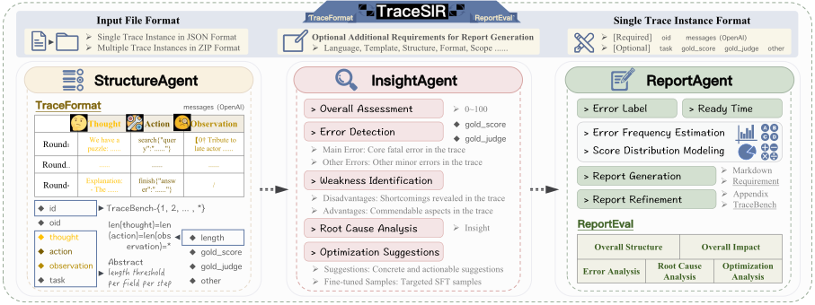
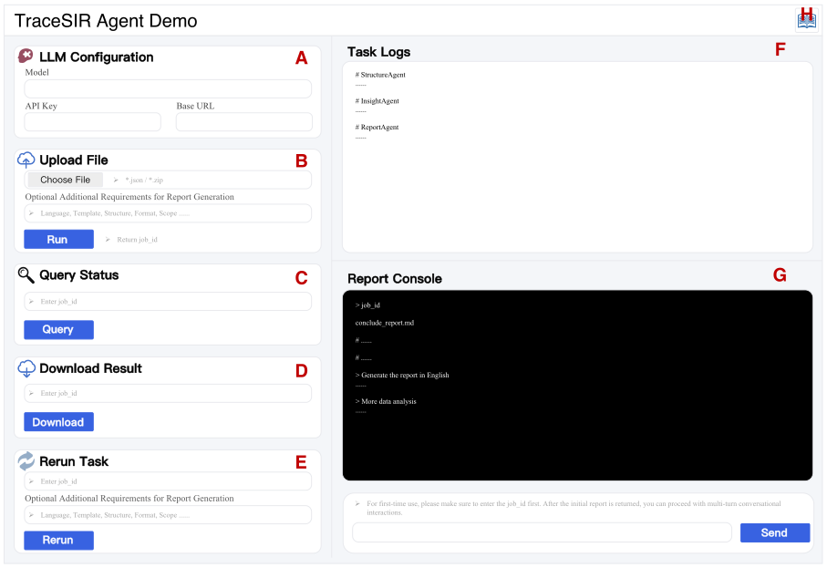

<div align="center">

# TraceSIR

### A Multi-Agent Framework for Structured Analysis and Reporting of Agentic Execution Traces

[](https://opensource.org/licenses/MIT)
[](https://www.python.org/downloads/)
[](https://www.docker.com/)
[](https://fastapi.tiangolo.com/)
[](https://openai.com/)
[](https://arxiv.org/abs/2603.XXXXX)
[](https://www.youtube.com/watch?v=2HBMuId0Cos)
[](https://github.com/SHU-XUN/TraceSIR/releases/download/v1.0.0/TraceSIR-v1.0.0-docker.tar.gz)



</div>

---

## Overview

**TraceSIR** is a multi-agent framework for structured analysis and reporting of agentic execution traces. TraceSIR coordinates three specialized agents: (1) StructureAgent, which introduces a novel abstraction format, *TraceFormat*, to compress execution traces while preserving essential behavioral information; (2) InsightAgent, which performs fine-grained diagnosis including issue localization, root cause analysis, and optimization suggestions; (3) ReportAgent, which aggregates insights across task instances and generates comprehensive analysis reports.

### Why TraceSIR?

- 🤖 **Automated Analysis**: Eliminate manual review of agent traces
- 📊 **Comprehensive Evaluation**: Multi-dimensional scoring and error detection
- 🔍 **Deep Insights**: Root cause analysis with actionable recommendations
- 📄 **Professional Reports**: Auto-generate detailed Markdown reports
- 🌐 **Web Interface**: User-friendly UI with real-time log streaming
- 🐳 **Easy Deployment**: One-command Docker deployment
- 🔌 **Flexible Integration**: Support for multiple LLM providers

---

## 🚀 Quick Start

### Prerequisites

- **Docker** (recommended) or **Python 3.11+**
- **LLM API credentials** (OpenAI, Azure, etc.)
- **Port 8000** available

### Option 1: Docker Image (Recommended)

```bash
# Download Docker image
wget https://github.com/SHU-XUN/TraceSIR/releases/download/v1.0.0/TraceSIR-v1.0.0-docker.tar.gz

# Load image
docker load -i TraceSIR-v1.0.0-docker.tar.gz

# Make a directory
mkdir data
chmod -R 777 data

# Run container
docker run -d -p 8000:8000 -v $(pwd)/data:/app/data tracesir:1.0.0

# Access
open http://localhost:8000
```

### Option 2: From Source

```bash
# Clone repository
git clone https://github.com/SHU-XUN/TraceSIR.git
cd TraceSIR

# Install dependencies
pip install -r requirements.txt

# Run
python -m uvicorn app:app --host 0.0.0.0 --port 8000

# Access
open http://localhost:8000
```

### First Run

1. Open http://localhost:8000 in your browser
2. Fill in LLM configuration:
   - **Model**: e.g., `gpt-4o-mini`
   - **API Key**: Your API key
   - **Base URL**: e.g., `https://api.openai.com/v1`
3. Upload trace data (JSON or ZIP)
4. Monitor progress in real-time
5. Download analysis results

---

## 📥 Download

### Release Packages and Other Materials

| Package | Size | Description | Download |
|---------|------|-------------|----------|
| **Docker Image** | ~160 MB | Pre-built Docker image | [⬇️ TraceSIR-v1.0.0-docker.tar.gz](https://github.com/SHU-XUN/TraceSIR/releases/download/v1.0.0/TraceSIR-v1.0.0-docker.tar.gz) |
| **Demo Video**| 2min 25s | Watch Demonstration Video | [🎥 TraceSIR-demo-video](https://www.youtube.com/watch?v=2HBMuId0Cos)
| **Demo Video**| ~226 MB | Download Demonstration Video | [⬇️ TraceSIR-demo-video](https://github.com/SHU-XUN/TraceSIR/releases/download/v1.0.0/TraceSIR.Demo.mp4.zip)

---

## 📖 Usage

### Input Format

TraceSIR accepts trace data in **TraceFormat-User** format (JSON):

```json
{
  "oid": "original-id-001",
  "task": "Task description",
  "messages": [
    {"role": "user", "content": "Initial user request"},
    {"role": "assistant", "content": "Agent thought process", "tool_calls": [...]},
    {"role": "tool", "content": "Tool execution result"}
  ],
  "gold_score": 0,
  "gold_judge": ["Evaluation information"],
  "other": "Additional metadata"
}
```

### Detailed Document

📘 A step-by-step tutorial is available here: [`templates/readme.md`](templates/readme.md)


### TraceSIR Demo



Note: To meet the team’s internal real-world usage requirements, the deployed demo is implemented in Chinese, and the default generated reports are also in Chinese. If reports in other languages are required, this can be specified in the additional requirements during the report generation stage.

---


## 📚 Citation

If you use TraceSIR in your research, please cite:

```bibtex
@misc{tracesir2026,
  title={TraceSIR: A Multi-Agent Framework for Structured Analysis and Reporting of Agentic Execution Traces}
  ...
}
```


---

<div align="center">

**[⬆ Back to Top](#tracesir)**

---

**Made with ❤️ by the TraceSIR Team**

**© 2026 TraceSIR. All rights reserved.**

</div>